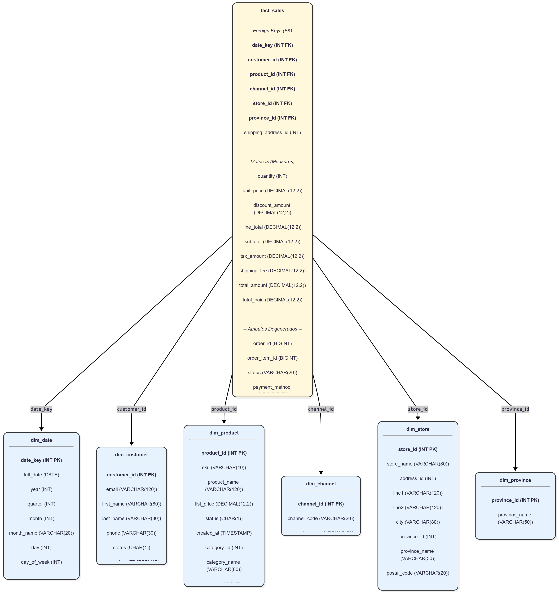
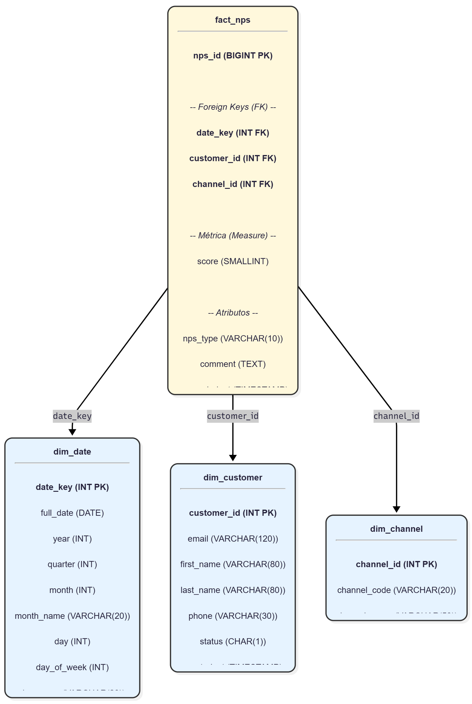
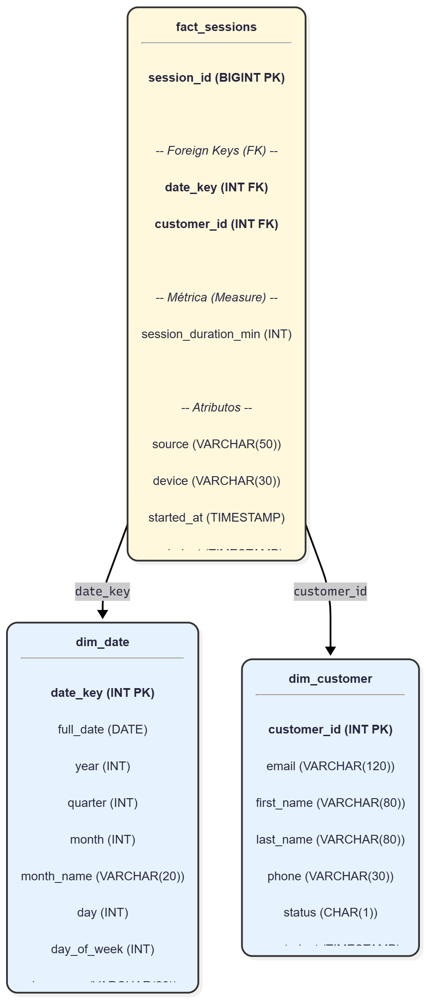
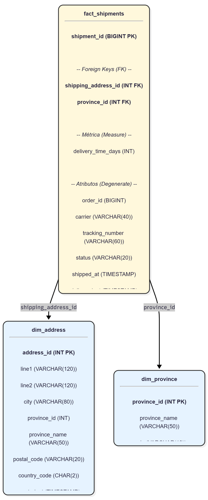

# Trabajo Práctico Final — Introducción al Marketing Online y los Negocios Digitales

Repositorio del trabajo práctico final de la materia.

**Consigna y documento principal:** [Trabajo Práctico Final](https://docs.google.com/document/d/15RNP3FVqLjO4jzh80AAkK6mUR5DOLqPxLjQxqvdzrYg/edit?usp=sharing)
**Diagrama Entidad Relación (OLTP):** [DER](./assets/DER.png)

---

## 1. Instrucciones de Ejecución

Siga estos pasos para replicar el entorno y ejecutar el pipeline ETL.

1.  **Clonar el Repositorio:**
    ```bash
    git clone [https://github.com/BMilesRouillon/mkt_tp_final.git](https://github.com/BMilesRouillon/mkt_tp_final.git)
    cd mkt_tp_final
    ```

2.  **Crear y Activar Entorno Virtual:**
    ```bash
    # (Desde PowerShell)
    python -m venv venv
    .\venv\Scripts\Activate.ps1
    ```

3.  **Instalar Dependencias:**
    (Se instalarán las librerías de la sección 5).
    ```bash
    pip install -r requirements.txt
    ```

4.  **Ejecutar el Pipeline ETL:**
    Este script principal orquesta la extracción, transformación y carga. Leerá los datos de `/raw` y generará los 11 archivos CSV limpios en la carpeta `/DW`.
    ```bash
    python scripts/run_pipeline.py
    ```

5.  **Visualizar el Dashboard:**
    [Enlace a tu Dashboard de Looker Studio] (Pendiente)

---

## 2. Supuestos y Decisiones de Diseño

* **Estructura del Pipeline:** El proyecto se estructuró como un pipeline ETL modular (`extract`, `transform`, `load`) orquestado por `scripts/run_pipeline.py`.
* **Encoding:** Los archivos `.csv` de origen (`raw/`) se leyeron con codificación `latin1` para interpretar correctamente acentos y caracteres especiales. Los archivos de salida (`DW/`) se guardaron en `UTF-8`.
* **Ventas Válidas:** `fact_sales` solo incluye órdenes con estado `'PAID'` o `'FULFILLED'`.
* **`dim_date`:** Esta dimensión fue generada por el pipeline. Toma la fecha mínima y máxima de todas las tablas de hechos (`sales_order`, `web_session`, `nps_response`) para crear un calendario completo.
* **Atributos de Dimensiones:** Se crearon dimensiones que contienen la mayor cantidad de atributos posibles de las tablas de origen (ej. `dim_product` incluye `sku`, `status`, `category_name`, etc.).

---

## 3. Diccionario de Datos (Esquemas Estrella)

Los siguientes diagramas actúan como el diccionario de datos visual del Data Warehouse en la carpeta `/DW`.

### 1. Modelo de Ventas (fact_sales)


### 2. Modelo de NPS (fact_nps)


### 3. Modelo de Sesiones (fact_sessions)


### 4. Modelo de Envíos (fact_shipments)


---

## 4. Lógica de KPIs (Consultas Clave)

La lógica principal para calcular los KPIs solicitados en Looker Studio (usando los archivos de la carpeta `/DW`) es la siguiente:

* **Total Ventas:**
    * `SUM(fact_sales[total_amount])`

* **Ticket Promedio:**
    * `SUM(fact_sales[total_amount]) / COUNT_DISTINCT(fact_sales[order_id])`

* **Usuarios Activos:**
    * `COUNT_DISTINCT(fact_sessions[customer_id])`

* **NPS (Net Promoter Score):**
    * `((COUNT(Promotores) - COUNT(Detractores)) / COUNT(Total Respuestas)) * 100`
    * *Promotor:* `fact_nps[score] >= 9`
    * *Detractor:* `fact_nps[score] <= 6`

* **Tiempo Prom. Entrega (Meta Mendoza):**
    * `AVG(fact_shipments[delivery_time_days])` (filtrado por `province_name = 'Mendoza'`)

---

## 5. Librerías Utilizadas (requirements.txt)

* **`pandas`**: Librería principal para la manipulación y transformación de datos (lectura de CSV, uniones/joins, filtros y cálculos).
* **`numpy`**: Dependencia de Pandas, utilizada para operaciones numéricas y de arrays de alto rendimiento.
* **`python-dateutil`**, **`pytz`**, **`six`**, **`tzdata`**: Dependencias de Pandas necesarias para el manejo avanzado de fechas, zonas horarias y compatibilidad entre versiones de Python.

---

## 6. Historial de Comandos de Consola

Toda la gestión del repositorio y la ejecución del pipeline se realizó a través de la consola de PowerShell. Los comandos clave utilizados fueron:

* **Configuración del Proyecto:**
    ```powershell
    git clone ...
    cd mkt_tp_final
    python -m venv venv
    .\venv\Scripts\Activate.ps1
    pip install pandas
    pip freeze > requirements.txt
    ```

* **Creación de Estructura ETL:**
    ```powershell
    mkdir scripts\extract
    mkdir scripts\transform
    mkdir scripts\load
    New-Item scripts\extract\__init__.py
    New-Item scripts\transform\__init__.py
    New-Item scripts\load\__init__.py
    New-Item scripts\extract\extractor.py
    New-Item scripts\transform\dimensions.py
    New-Item scripts\transform\facts.py
    New-Item scripts\load\loader.py
    New-Item scripts\run_pipeline.py
    ```

* **Ejecución del Pipeline:**
    ```powershell
    python scripts/run_pipeline.py
    ```

* **Gestión de Repositorio (Git):**
    ```powershell
    git add .
    git commit -m "..."
    git pull origin main
    git push origin main
    ```

* **Gestión de Documentación (README y Assets):**
    ```powershell
    ls raw
    Remove-Item ...
    Copy-Item ...
    Set-Content ...
    Add-Content ...

## 7. CAPTURAS DEL TABLERO


